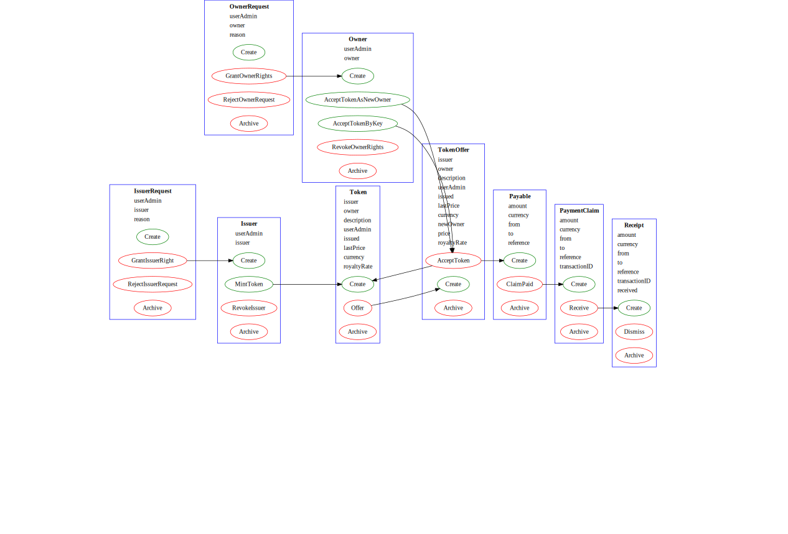

# Daml Sandbox

An overview guide on [Daml](https://www.digitalasset.com/developers) language.

## Getting started

[Daml docs](https://docs.daml.com/getting-started/installation.html#) provide a great **Getting Started** guide. This project will be based on **Daml Open Source**.

> Please take into account that projects generated by **Daml** toolkit may be provided under different licensing terms than this guide.

```powershell
daml version
```

Displays versions of installed SKDs.

```powershell
daml new <project_name>
```

Creates new project with a specified name and default template. To specify the template use:

```powershell
daml new <project_name> --template <template_name>
```

```powershell
daml new --list
```

Lists all the available project templates

## Templates

They are the most important component of **Daml** ecosystem. They define **data** and **behavior** of **Contracts** on **Daml Ledger**. Which means they provide logic that answers these questions:

* Who can see what?
* Who can alter the ledger?
* How can they alter the ledger?
* Under what conditions?

> Contracts are immutable in **Daml** - once created they cannot be changed

### `With` section

**Template** declaration must start with: `with` section. Data fields are defined in the `with` section.

> The requirement the `with` section is to contain at least one `Party`.  

```haskell
template MyOffer
  with
    issuer: Party
    owner: Party
    price: Decimal
    royaltyRate: Deciaml
    (...)
```

> In general `with` section a mix of **Parties** included in the contract as well as the contract's **payload**.

### `where` section

The `where` section contains:

* `signatory` - list of **Parties** that are being stated as **signatories** of the **contract**. A **signatory** is a participant in a contract which consented to the creation of that template.

  >The requirement is to have at least one **Party** stated as the signatory

* `observer` (optional) - including **Parties** as **observers** allows to make these **Parties** aware of the contract. Whereas if some **Party** is specified in the `controller` block, the **Party** will be aware of the contract anyway, so the `observer` block should be used for granting the right to see the contract to additional **Parties**.

* `ensure` (optional) - boolean expression, that has to be `true` for the contract creation. E.g.  

  ```haskell
  ensure royaltyRate >= 0.0 && lastPrice >= 0.0
  ```

* `key` - a uniqe identifier of a token E.g.

  ```haskell
  key (issuer, owner, description): (Party, Party, Text)
  ```

  means that combination of these three data items must be unique. All data types can be used for `key` construction.

* `maintainer` - a **Party** responsible for `key` uniqueness (although `key` uniqueness if provided by the ledger itself)

* other blocks that create so called **choices**

### Choices

#### Explained on old but easier to understand syntax

> A template can include **zero or more** **choices**. **Choices** are very important, because they define the rules on how the ledger can be changed, like: **who can change** the ledger? under **what conditions** and **what do** these changes actually **mean**?

The most of **daml** action will be taking place inside the **choice's** body. Despite choices there is only one other way to mutate the ledger - create contract from scratch. But only contract with single signatory can be created from scratch, so once again - most of the ledger updated will take place as the result of **choice** execution.

* `controller` is an obligatory part of every **choice** that indicate what **Parties** can exercise the **choice**. All of the specified `controller` **Parties** have to sign off to perform the **choice** execution.

  ```haskell
  controller newOwner, userAdmin can 
  ```

* **Name** of the **choice** followed by **return type** is the next element of choice structure E.g.

  ```haskell
  controller newOwner, userAdmin can 
    AcceptToken: ContractId Token
  ```

  **choice's** **return type** provides convenience, to other **choice** that might be calling this one, so the other **choice** can get a handle on the result of executing that **choice**.

  There is no necesisty to include all the results of a **choice** in the **return type**, but it is convenient to do so.

  If the **return type** is specified, the last line of the **choice** with the **return** statement and returned object, must match the type with the **return type**.

* **Parameters** (optionally) can be specified as a next part, using `with` keyword.

* **Body** of the choice, starting with `do` keyword.

  All the actions one would like to perform are being defined there. E.g.
  * asserting any features of parameters that have been passed in
  * archiving actions
  * creating actions
  * any other ledger updates

Example **choice** could look something like this:

 ```haskell
do
  newToken <- create Token
    with
      owner = newOwner
      lastPrice = price
      (...)
  return newToken
 ```

In above example new **Token** is being created, it's properties are being initialazed with values: **newOwner** and **price**, which are data fields of the template. The **token** is assigned to the variable **newToken**.

> despite creating the Token it is also being **archived**, but this does not need to be specified, since it's the default behaviour - always the contract from from which choice is called is being removed from the active state of the ledger. This behaviour can be overriden by `non consuming` keyword.

Choices also are **atomic** similar to **SQL** transactions. If some part of the choice fails - the whole operation is rolled back

#### Creating choices using new syntax

[Official documentation](https://docs.daml.com/daml/reference/choices.html) explains the differences very well nevertheless it is worth to mention some basic information here as well.

The **new syntax** is more simmilar to object oriented programming lanugages class syntax. Analysing below example could be pretty self-explainatory, but there is something that should be noticed with the **new syntax**:

> **Controllers** are not anymore automatically added **as observers**, therefore they have to be explicitly stated so, to be able to see the contract and exercise the choice.

```haskell
choice <Name_of_the_choice> : <Return_type>
      with --arguments here
        newOwner : Party
      observer owner
      controller owner
      do create this with --body starts with do
           owner = newOwner
```

## Modules

They are utilized to group templates together in order to form logical aggregations around some common matter. It's a similar concept to **namespaces** found in **Object Oriented Programming**.

## Double dot operator

`..` is used when creating a contract from a template, to pass all data fields from the calling contract. E.g.

```haskell
do
  create PaymentClaim with ..
```

will pass all data fields stated in the template that contains the choice invoking the PaymentClaim to PaymentClaim.

## Text conatenation

`<>` operator is used to concatenate text E.g.

```haskell
reference = "Notional for '" <> description <>"'"
```

## Choice returning multiple values

In order to return multiple values, assign the values that are about to be returned to variables and combine them in a tuple. Return tuple of theses values. E.g.

```haskell
do
        fromNewOwnerToOwner <- create Payable
          with
            from = newOwner
            to = owner
            amount = price
            currency
            reference = "Notional for '" <> description <>"'"

        newToken <- create Token
          with
            owner = newOwner
            lastPrice = price
            ..

        return (newToken, fromNewOwnerToOwner)
```

## Manual Testing

`Main` module is a good place to perform some testing actions. Basic. The way to test the functionality is to:

* Create some parties
* Perform interactions between them

## Optionals: opX

In **Daml** it is a concept of a variable being allowed to be `null`.

For examlpe when declaring one of the returned values of a choice to be **optional**, code would look like below:

```haskell
choice AcceptToken: (ContractId Token, ContractId Payable, Optional (ContractId Payable))
```

There's a dedicated module in [Daml Standard Library](https://docs.daml.com/daml/stdlib/DA-Optional.html) to help deal with optional parameters.

## Fmap: <$>

It's a mapping function that allows to map some **functions** onto **arrays**. E.g.

```haskell
(\x -> x*x) <$> [1,2,3]
```

above code will map **square function** onto array, which will result in array of values `[1,4,9]`, since the **square function** will be executed on every element of the array.

Constructors are also allowe to be used on the left side of the operator. (Which makes sense since constructors are also functions) E.g.

```haskell
SomeTemplate <$> [1,2,3]
```

will result in contract array `[Some1, Some2, Some3]`.

Surprisingly right side of the operator does not have to be an array, but also **ledger update**

```haskell
SomeTemplate <$> create Thing with ..
```

Above code could be equivalent to:

```haskell
do
  x <- create Thing with ..
  return (SomeTemplate x)
```

## If-else statement

```haskell
condRoyaltyPayment <- if owner == issuer
          then return None
          else Some <$> create Payable
            with
              ...
```

---

## NFT

stands for **Private Non-fungible token**.
main characteristics of **NFTs** are:

* Content creators can mint **NFTs**
* Owners can sell their **NFTs**
* to do so they have to pay royalties to content creators

**NFTs** can be either **private** or **public**. What separates private **NFTs** from public **NFTs** is that:

* participants of the network whether they are creators or owners must be explicitly permitted by some kind of **userAdmin**

Guide on example of **NFT** created using **Daml** can be found [here](./creating-private-NFT.md).

## Visualizing templates

**Daml SDK** contains a functionality to generate `.DOT` files with **module diagrams** by default. While using **VS Code**:

> **Command pallete** > **Visualize Daml Project**

is used to generate the diagram. To preview generated diagram use any **Graphviz** extension of choice. In my case couple of them were not working.

Example diagram:


* bold is used to display **template name**
* underneath **data fields** are displayed with regular font
* ellipses contain template's **choices**
* arrows represent **realation** of type: ***choice results in contract creation***

Additional info can be found in [Daml Docs article](https://docs.daml.com/tools/visual.html) dedicated to that matter.

---

## Running the project in **Daml sandbox**

* `daml.yaml` file must be configured at the beginning. This includes:
  * do make sure that the init script points to the script at `Main.yaml`

    ```yaml
    init-script: Main:setup
    ```

  * get familiar with [Daml Discuss Issue: Navigator not showing contracts](https://discuss.daml.com/t/navigator-not-showing-contracts/5284)
  * **do not** add parties included in the script or any other parties to conifuration file!
  * disable **user management feature**

    ```yaml
    navigator-options:
    - --feature-user-management=false
    ```

* run the sandbox

  ```powershell
  daml start
  ```

In case of any problems Daml docs on: [Daml Sandbox](https://docs.daml.com/tools/sandbox.html) and [Navigator](https://docs.daml.com/tools/navigator/index.html) can be found helpful.  

---

## Creating **TypeScript**/**JavaScript** bindings

* build the project

  ```powershell
  daml build
  ```
  
  That will result in `.DAR` file creation in `.daml/dist` directory.

* use `codegen` utility to actually generate **JS**/**TS** bindings.

  ```powershell
  daml codegen js -o <output_directory> <dar_file_path>
  ```  

## Using **JSON API** with application running in **Daml Sandbox**

First make sure that sandbox with the project is running `daml start`. Default port for the **JSON API** is `7575`.
Running a plain request to the **JSON API** will result in authentication error.

```bash
curl http://localhost:7575/v1/query
```

> errors":["missing Authorization header with OAuth 2.0 Bearer Token"],"status":401}

Therefore some token needs to be generated and later attached to any request to actually authenticate that the issuer of the **HTTP** request is really representing the party that he claims he is.

To do so <https://jwt.io> will be used. Remember that it's only **Sandbox** solution. In production some thir party authentication service will be responsible for issuing and validation of tokens.

According to [Daml Docs instructions](https://docs.daml.com/json-api/index.html#:~:text=For%20a%20ledger%20without%20authorization%2C%20e.g.%2C%20the%20default%20configuration%20of%20Daml%20Sandbox%2C%20you%20can%20use%20https%3A//jwt.io%20(or%20the%20JWT%20library%20of%20your%20choice)%20to%20generate%20your%20token.%20You%20can%20use%20an%20arbitrary%20secret%20here.%20The%20default%20%E2%80%9Cheader%E2%80%9D%20is%20fine.%20Under%20%E2%80%9CPayload%E2%80%9D%2C%20fill%20in%3A) given payload has to be included:

```json
{
  "https://daml.com/ledger-api": {
    "ledgerId": "sandbox",
    "applicationId": "foobar",
    "actAs": ["Alice"]
  }
}
```

In my case the:

* `/v1/query` - endpoind gave successfull response (Code 200), but the returned value was empty

Other endpoints such as:

* `/v1/parties`
* `/v1/users`
* `/v1/packages`

returned values as expected.

Reason for such behaviour of `/v1/query` endpoint has not been yet identified.

---

## References

* [Daml Docs](https://docs.daml.com/)

* [Daml Developer forum](https://discuss.daml.com/)

* [Daml Cheat Sheet](https://docs.daml.com/cheat-sheet)

* [Daml Talent Lms (requires account)](https://daml.talentlms.com/dashboard/index)

* [Daml Docs article on visualizing Daml Contracts automatically](https://docs.daml.com/tools/visual.html)
